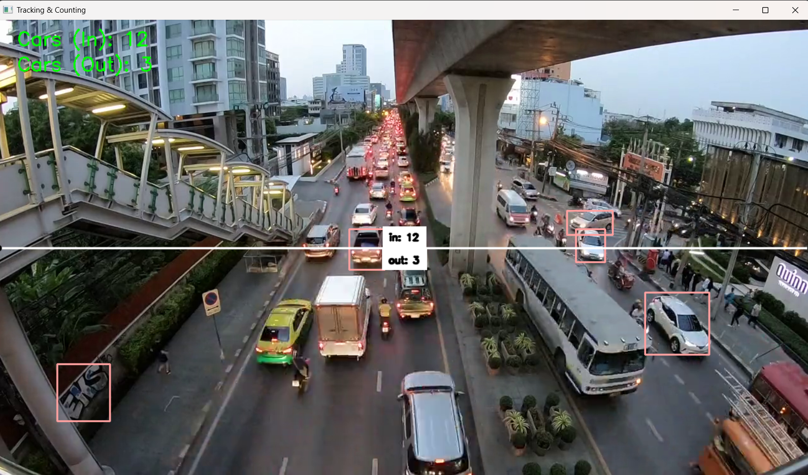

# Object Tracking & Counting with YOLOv8


## Overview
This project demonstrates real-time **Object detection, tracking, and counting** using **YOLOv8**, **Supervision**, and **OpenCV**. The goal is to track Object movement across a defined line in a video and count how many people enter and exit. This approach is useful for applications like **crowd analysis, surveillance, and retail analytics**.

---

## Problem Tackled
This assists in crowd management, retail store analytics and surveillance systems.

## Introduction
Tracking and counting Object in video streams is a crucial task in computer vision. This project leverages **YOLOv8 for object detection** and the **Supervision library** for line-based counting to build a robust, real-time tracking and counting pipeline.

### Objectives
- Detect and track Object in videos using YOLOv8.
- Count the number of Object crossing a predefined line.
- Annotate bounding boxes and counts in real-time.
- Provide a reusable framework for similar surveillance or analytics tasks.

---

## Video Source
### Input
- The project works with any Object activity video.  
- Example videos included in repo: `mallCrowd.mp4` (for crwod counting in mall), `highwayTraffic.mp4` (for car counting in traffic)

You can replace it with your own video by updating the `VIDEO_PATH` variable in the code.

---

## Technologies Used
- **Python**: Core programming language.
- **YOLOv8 (Ultralytics)**: Object detection.
- **Supervision**: Line zone tracking & annotation.
- **OpenCV**: Video processing & visualization.
- **NumPy**: Numerical operations.

---

## Installation
### Prerequisites
Ensure Python (>= 3.8) is installed on your system.

### Steps
1. Clone the repository:
   ```bash
   git clone https://github.com/SHRESTHA-012/Object-Detection-and-Counting.git
   cd Object-Detection-and-Counting
   ```
2. Create and activate a virtual environment:
   ```bash
   python -m venv venv
   venv\Scripts\activate
   ```
3. Install dependencies:
   ```bash
   pip install -r requirements.txt
   ```
4. Place your input video (e.g., `mallCrowd.mp4`) in the project directory if not already available.

---

## Usage
Run the following command:
```bash
python appTraffic1.py
```
or try other scripts (`appTraffic2.py`, `appMall.py`) depending on your experiment.

The script will:
- Load YOLOv8 model (e.g., `yolov8s.pt` or `yolov8m.pt`).
- Detect Object in each frame.
- Track and count people crossing a virtual line.
- Display real-time annotated output.

Press **ESC** to exit the video window.

---

📷 Preview of Running project

---

## Features
- **Real-Time Detection**: Using YOLOv8 for accurate person detection.
- **Line-Based Counting**: Entry/Exit count tracking with Supervision.
- **Bounding Box Annotation**: Visualize detections with bounding boxes.
- **Customizable**: Works with any video source.
- **Lightweight & Fast**: Runs efficiently on CPU/GPU.

---

## Results
- **Accurate Tracking**: Object crossing the line are counted in both directions.
- **In/Out Metrics**: Displayed directly on the video feed.
 

---
## Note
images folder contains the preview image of the output to be displayed in the readme file.


